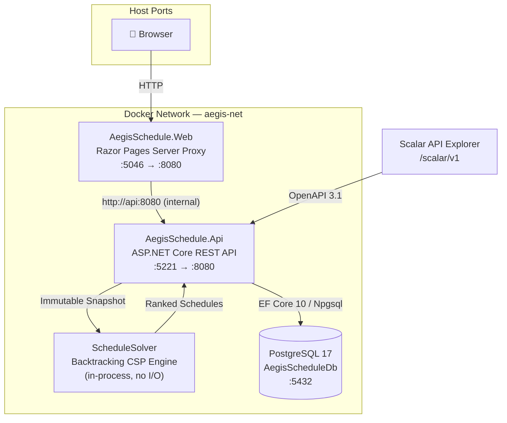
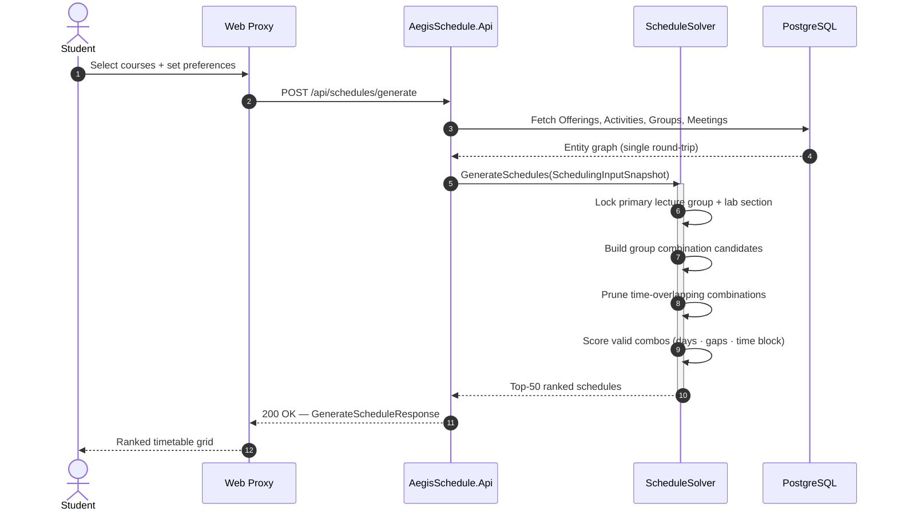

<div align="center">

# AegisSchedule

**A .NET 10 scheduling API that generates conflict-free university timetables from combinatorial course catalogs.**

[](https://github.com/mkarimdev/AegisSchedule/actions/workflows/ci.yml)
[](https://dotnet.microsoft.com/en-us/)
[](https://learn.microsoft.com/en-us/dotnet/csharp/)
[](https://www.postgresql.org/)
[](http://localhost:5221/scalar/v1)
[](LICENSE)

</div>

---

## Why This Exists

I'm **Karim Mohamed**, a Computer Science student at **Minia National University (MNU)**, Egypt. I transferred into MNU at Level 2, which meant carrying over prerequisites and overloading 18+ credit hours every semester across multiple academic levels just to stay on track for graduation.

MNU's SIS has no automated schedule generator. Every semester, I'd spend hours manually checking a 30+ column timetable grid — course by course, group by group — to find a combination without time collisions. One wrong overlap meant a whole chain of choices fell apart and I had to start over.

So I built AegisSchedule. It's a deterministic REST API that takes a student's selected course offerings, applies hard time-collision constraints, and returns every valid schedule ranked by configurable soft preferences (fewer active days, shorter gaps, morning or evening blocks). What used to take hours of grid-staring takes milliseconds.

---

## What AegisSchedule Is

**AegisSchedule.Api** is the product. It's a self-contained .NET 10 REST API microservice that:

- Stores a course catalog (Terms → Courses → Offerings → Activities → Groups → Meetings) in PostgreSQL.
- Exposes a clean admin API (key-protected) to build and manage that catalog.
- Accepts a schedule generation request with a student's selected offerings and preferences.
- Runs a backtracking constraint-satisfaction solver entirely in memory — no I/O, no ML, no guessing — and returns ranked conflict-free schedules.

**AegisSchedule.Web** is a reference client. It's an ASP.NET Core Razor Pages application that demonstrates how to consume the API from a browser-facing UI. It acts as a secure server-side proxy so the admin API key never reaches the browser.

> If you want to integrate AegisSchedule into your own university system, you only need the API.
> The Web project is there to show one way to build a UI on top of it.

---

## How the Solver Works

1. A student selects courses from the catalog and sends a `POST /api/schedules/generate` request.
2. The API fetches all relevant activity groups and meeting times from PostgreSQL in a single round-trip.
3. The data is projected into an immutable in-memory snapshot — the database is no longer involved.
4. The solver builds a Cartesian product of all group combinations and prunes any combination where two meetings overlap on the same day (`[Start, End)` interval intersection).
5. Valid combinations are scored by a weighted sum of three soft-preference axes: active day count, idle gap duration, and time-of-day preference.
6. The top 50 ranked schedules are returned in the response.

The solver has zero database access during execution. It can be unit-tested and benchmarked with thousands of permutations in pure in-memory xUnit tests.

---

## Feature Summary

| Feature | Detail |
|---------|--------|
| **Dual Cohort Lock** | When a student names their primary lecture group and lab section, the solver locks those in for same-level courses and only evaluates the remaining free groups. |
| **Hard Constraint Pruning** | Any combination with a time overlap is rejected before scoring. No overlapping schedule can reach the output. |
| **3-Axis Soft Scoring** | Minimize active days + minimize idle gaps + prefer time block, each independently weighted per request. |
| **Timing-Safe Auth** | Admin endpoints compare the `X-Admin-Api-Key` header using `CryptographicOperations.FixedTimeEquals` — resistant to timing attacks. |
| **Server-Side Proxy** | The Web client never exposes API credentials to the browser. All sensitive calls go server-to-server. |
| **Auto-Migration on Boot** | EF Core migrations run automatically at API startup via `Database.MigrateAsync()`. No manual CLI steps needed. |
| **Scalar OpenAPI Explorer** | Interactive API docs at `/scalar/v1` — no Swagger UI. |

---

## Quick Start — Docker

```bash
docker compose up -d --build
```

| Service | URL |
|---------|-----|
| Web UI | http://localhost:5046 |
| Scalar API Explorer | http://localhost:5221/scalar/v1 |
| API Base | http://localhost:5221/api |
| PostgreSQL | `localhost:5432` — db: `AegisScheduleDb`, user: `postgres` |

On first boot, the API container applies all EF Core migrations automatically before accepting requests.

```bash
# Stop
docker compose down

# Full reset (drops database volume)
docker compose down -v
```

---

## Local Development (No Docker)

**Prerequisites**: [.NET SDK 10.0+](https://dotnet.microsoft.com/download) and [PostgreSQL 17+](https://www.postgresql.org/)

```bash
# Clone
git clone https://github.com/mkarimdev/AegisSchedule.git
cd AegisSchedule

# Configure — edit src/AegisSchedule.Api/appsettings.Development.json
# Set ConnectionStrings.DefaultConnection to your PostgreSQL instance

# Run the API (migrates on boot)
dotnet run --project src/AegisSchedule.Api
# → http://localhost:5221

# Run the Web UI (separate terminal, optional)
dotnet run --project src/AegisSchedule.Web
# → http://localhost:5046

# Run all 58 tests
dotnet test AegisSchedule.sln
```

---

## Architecture

### System Diagram



### Solver Request Flow



### Dependency Rules

```
[ AegisSchedule.Web ]
        │
        │  HTTP/JSON — server-to-server
        ▼
[ Controllers + DTOs ]
        │                  │
        ▼                  ▼
[ Persistence (EF Core) ]  [ Solver (CSP Engine) ]
        │                       │
        └────► [ Domain ] ◄──────┘
               (pure C# — zero external dependencies)
```

The `Domain/` layer has no references to EF Core, ASP.NET Core, or Npgsql. The `Solver/` layer has no references to any I/O, database, or HTTP context. This is enforced by namespace separation within `AegisSchedule.Api.csproj`.

---

## REST API Reference

Full interactive documentation: **`http://localhost:5221/scalar/v1`**

An executable `.http` collection covering all endpoints is at [`src/AegisSchedule.Api/Api.http`](src/AegisSchedule.Api/Api.http) — compatible with VS Code REST Client and JetBrains HTTP Client.

### Public Endpoints

| Method | Route | Description |
|--------|-------|-------------|
| `GET` | `/api/catalog/levels` | List academic levels |
| `GET` | `/api/catalog/offerings` | List offerings (filterable by `?academicLevel=` and `?termId=`) |
| `POST` | `/api/schedules/generate` | Generate ranked conflict-free schedules |

#### Schedule Generation — Example Request

```json
POST /api/schedules/generate
Content-Type: application/json

{
  "academicLevelNumber": 2,
  "primaryLectureGroupName": "G1",
  "primaryLabSectionName": "L1",
  "selectedCourseOfferingIds": ["<offering-guid>", "<offering-guid>"],
  "minimizeDaysWeight": 5,
  "minimizeGapsWeight": 3,
  "preferredTimeBlock": "Morning",
  "preferredTimeBlockWeight": 2
}
```

`preferredTimeBlock` accepts `"None"`, `"Morning"`, or `"Evening"`. Weights are integers — higher values increase that axis's influence on the ranking.

### Admin Endpoints (require `X-Admin-Api-Key` header)

| Area | Endpoints |
|------|-----------|
| **Terms** | `GET`, `POST /api/admin/terms` · `PUT /api/admin/terms/{id}/set-current` |
| **Courses** | `GET`, `POST /api/admin/courses` · `GET`, `PUT`, `DELETE /api/admin/courses/{id}` |
| **Offerings** | `GET`, `POST /api/admin/offerings` · `GET`, `DELETE /api/admin/offerings/{id}` |
| **Activities** | `POST /api/admin/offerings/{id}/activities` · `DELETE /api/admin/activities/{id}` |
| **Groups** | `POST /api/admin/activities/{id}/groups` · `PUT`, `DELETE /api/admin/groups/{id}` |
| **Meetings** | `POST /api/admin/groups/{id}/meetings` · `PUT`, `DELETE /api/admin/meetings/{id}` |
| **SIS Bulk Sync** | `POST /api/admin/sis/sync` (single-pass transactional catalog batch ingestion) |

---

## Repository Layout

```
AegisSchedule/                 ← repository root
├── .github/
│   └── workflows/
│       └── ci.yml             # GitHub Actions CI — build + 58 tests
├── docs/
│   ├── ARCHITECTURE.md        # Architecture reference
│   └── SIS_INTEGRATION_GUIDE.md  # Stage 2 SIS/ERP integration guide
├── src/
│   ├── AegisSchedule.Api/     # The product — .NET 10 REST API
│   │   ├── Controllers/       # HTTP endpoints
│   │   ├── Domain/            # Pure domain entities (no external deps)
│   │   ├── DTOs/              # Request/response contracts
│   │   ├── Migrations/        # EF Core migrations (source-controlled)
│   │   ├── Persistence/       # DbContext + entity configurations
│   │   ├── Security/          # Admin API key filter
│   │   ├── Solver/            # Backtracking CSP solver + scoring
│   │   ├── Api.http           # Executable REST test collection
│   │   └── Dockerfile
│   └── AegisSchedule.Web/     # Reference client — Razor Pages UI
│       ├── Pages/
│       ├── Services/          # Typed HTTP clients for the API
│       └── Dockerfile
├── tests/
│   └── AegisSchedule.Tests/   # xUnit — 58 test cases
├── .dockerignore
├── AegisSchedule.sln
├── CONTRIBUTING.md
├── docker-compose.yml
├── LICENSE
└── README.md
```

---

## Technology Stack

| Layer | Technology |
|-------|-----------|
| Runtime | .NET 10 / C# 14 |
| Web API | ASP.NET Core |
| API Explorer | Scalar + OpenAPI 3.1 |
| ORM | Entity Framework Core 10 |
| Database | PostgreSQL 17 (Npgsql) |
| Reference UI | ASP.NET Core Razor Pages |
| Tests | xUnit 2.9.3 + EF Core InMemory |
| CI | GitHub Actions |
| Containers | Docker + Docker Compose |

---

## Contributing

See [CONTRIBUTING.md](CONTRIBUTING.md) for branch naming, coding rules, and PR guidelines.

All 58 tests must pass before a PR can merge: `dotnet test AegisSchedule.sln`

---

## License

[MIT](LICENSE) — Copyright © 2026 AegisSchedule Contributors
