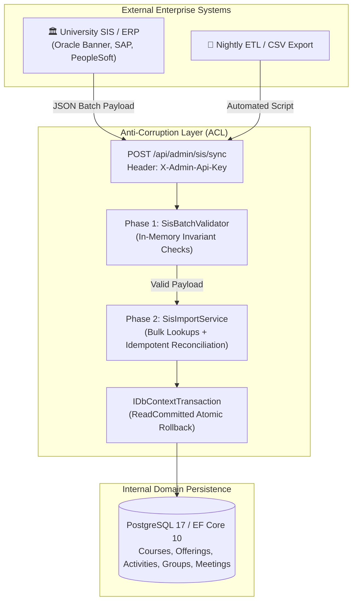
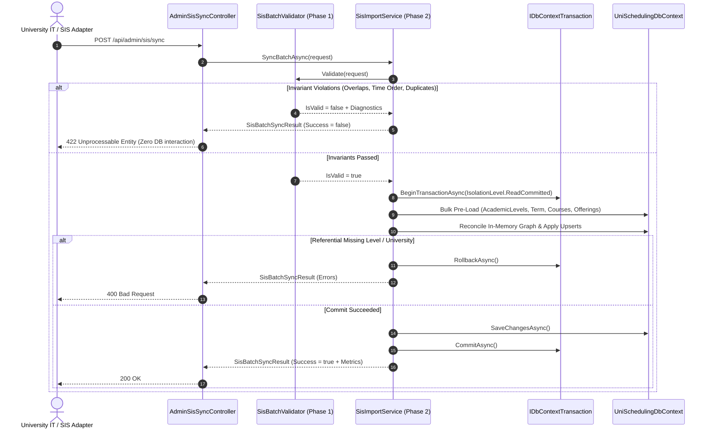

# AegisSchedule — SIS Integration Guide (Anti-Corruption Layer)

> **Status**: **Implemented (Phase 14)**. The AegisSchedule API provides a production-ready, transactional bulk ingestion endpoint (`POST /api/admin/sis/sync`) protected by `X-Admin-Api-Key`. This guide documents the Anti-Corruption Layer (ACL), request/response schemas, reconciliation modes, validation architecture, and institutional integration patterns.

---

## Overview

The AegisSchedule architecture supports two ingestion workflows:

1. **Granular Admin REST API** (Phase 8–10): Multi-step, manual catalog maintenance via the web UI.
2. **Bulk Ingestion Endpoint & ACL** (Phase 14): High-performance, single-pass batch synchronization for institutional SIS/ERP platforms (e.g., Oracle Banner, SAP Campus Management, Ellucian Colleague, PeopleSoft Campus Solutions, flat-file feeds):



---

## 1. Bulk Ingestion API Specification

### Endpoint Details

- **Method**: `POST`
- **Route**: `/api/admin/sis/sync`
- **Authentication**: `X-Admin-Api-Key: <ADMIN_SECRET_KEY>`
- **Content-Type**: `application/json`
- **Accept**: `application/json`

### HTTP Status Codes

| Status Code | Description | Scenario |
|---|---|---|
| `200 OK` | Batch synchronization succeeded | Entire catalog graph synced. Returns `SisBatchSyncResult` with metrics. |
| `400 Bad Request` | Missing foreign reference or empty payload | Target `UniversityId` or `AcademicLevelNumber` not found in database. |
| `422 Unprocessable Entity` | Data validation or domain invariant violation | Meeting time ordering (`StartTime >= EndTime`), intra-group overlaps, duplicate codes. |
| `401 Unauthorized` | Missing or invalid API key | Request lacks valid `X-Admin-Api-Key` header. |
| `409 Conflict` | Concurrency or database constraint violation | Unresolvable conflict during transactional save; changes rolled back. |

---

## 2. Request Schema: `SisBatchSyncRequest`

The sync payload allows university IT to submit an entire term catalog (Courses, Offerings, Activities, Groups, Meetings) in a single transactional HTTP call using natural keys.

### Synchronization Modes (`SisSyncMode`)

| Mode Value | Enum Name | Reconciliation Strategy |
|---|---|---|
| `1` | `Upsert` *(Default)* | Updates existing courses and offerings; inserts new ones. Existing activities and groups are updated in place, group meetings are updated, and unmentioned offerings are left intact. |
| `2` | `ReplaceOfferings` | Replaces the schedule slots (activities, groups, and meetings) for all offerings included in the payload, while preserving untouched course offerings. |
| `3` | `FullTermReconcile` | Reconciles the entire term. Any course offering currently in the database for the target term that is omitted from the batch payload is purged cascade along with its activities, groups, and meetings. |

### Complete JSON Payload Example

```json
{
  "mode": "Upsert",
  "universityId": null,
  "term": {
    "semester": "Fall",
    "year": 2026,
    "setAsCurrent": true
  },
  "courses": [
    {
      "code": "CS101",
      "name": "Introduction to Computer Science",
      "academicLevelNumber": 1,
      "externalCourseId": "SIS-CS-101",
      "activities": [
        {
          "type": "Lecture",
          "groups": [
            {
              "name": "LEC-01",
              "externalSectionId": "CRN-10001",
              "meetings": [
                {
                  "dayOfWeek": "Sunday",
                  "startTime": "08:30:00",
                  "endTime": "10:00:00",
                  "room": "Hall A"
                }
              ]
            }
          ]
        },
        {
          "type": "Lab",
          "groups": [
            {
              "name": "LAB-01",
              "externalSectionId": "CRN-10002",
              "meetings": [
                {
                  "dayOfWeek": "Tuesday",
                  "startTime": "10:30:00",
                  "endTime": "12:30:00",
                  "room": "Lab 101"
                }
              ]
            },
            {
              "name": "LAB-02",
              "externalSectionId": "CRN-10003",
              "meetings": [
                {
                  "dayOfWeek": "Thursday",
                  "startTime": "12:30:00",
                  "endTime": "14:30:00",
                  "room": "Lab 102"
                }
              ]
            }
          ]
        }
      ]
    },
    {
      "code": "MATH101",
      "name": "Calculus I",
      "academicLevelNumber": 1,
      "externalCourseId": "SIS-MATH-101",
      "activities": [
        {
          "type": "Lecture",
          "groups": [
            {
              "name": "LEC-01",
              "externalSectionId": "CRN-20001",
              "meetings": [
                {
                  "dayOfWeek": "Monday",
                  "startTime": "09:00:00",
                  "endTime": "11:00:00",
                  "room": "Hall B"
                }
              ]
            }
          ]
        },
        {
          "type": "Tutorial",
          "groups": [
            {
              "name": "TUT-01",
              "externalSectionId": "CRN-20002",
              "meetings": [
                {
                  "dayOfWeek": "Wednesday",
                  "startTime": "11:00:00",
                  "endTime": "12:30:00",
                  "room": "Room 204"
                }
              ]
            }
          ]
        }
      ]
    }
  ]
}
```

---

## 3. Response Schema: `SisBatchSyncResult`

### Successful Sync (`200 OK`)

```json
{
  "success": true,
  "termId": "060d0b04-a15e-4c7c-b630-fcf400bca877",
  "termName": "Fall 2026",
  "metrics": {
    "coursesCreated": 2,
    "coursesUpdated": 0,
    "offeringsCreated": 2,
    "offeringsUpdated": 0,
    "activitiesCreated": 4,
    "groupsCreated": 5,
    "meetingsCreated": 5,
    "entitiesRemoved": 0,
    "elapsedMilliseconds": 142
  },
  "errors": [],
  "warnings": []
}
```

### Validation Error (`422 Unprocessable Entity`)

```json
{
  "success": false,
  "termId": "00000000-0000-0000-0000-000000000000",
  "termName": "",
  "metrics": {
    "coursesCreated": 0,
    "coursesUpdated": 0,
    "offeringsCreated": 0,
    "offeringsUpdated": 0,
    "activitiesCreated": 0,
    "groupsCreated": 0,
    "meetingsCreated": 0,
    "entitiesRemoved": 0,
    "elapsedMilliseconds": 3
  },
  "errors": [
    {
      "code": "INTRA_GROUP_OVERLAP",
      "entityPath": "Courses[CS101].Activities[Lecture].Groups[LEC-01].Meetings[0,1]",
      "message": "Meetings on Sunday (08:30-10:00) and (09:00-10:30) overlap within group 'LEC-01'."
    }
  ],
  "warnings": []
}
```

---

## 4. Two-Phase Validation & Transactional Architecture

To eliminate catalog corruption, AegisSchedule executes ingestion in two distinct phases:



### Invariant Rules Enforced by Phase 1 Validator

1. **Non-Zero Duration**: `StartTime < EndTime` for all meeting slots.
2. **Zero Intra-Group Overlaps**: No group may schedule overlapping meetings on the same day.
3. **Unique Group Names**: Group names within each activity must be unique (case-insensitive).
4. **Unique Activity Types**: An offering cannot have duplicate activity types (e.g. at most one `Lecture`, `Lab`, `Tutorial`).
5. **Unique Course Codes**: Inbound course codes within the payload must be unique (case-insensitive).

---

## 5. Idempotency & Zero Duplicate Key Exceptions

The import engine guarantees **strict idempotency** ($f(f(x)) = f(x)$):

1. **Natural Key Resolution**:
   - `Course`: Matched by `(UniversityId, Code.ToUpperInvariant())`.
   - `Term`: Matched by `(Semester, Year)`.
   - `CourseOffering`: Matched by `(CourseId, TermId)`.
   - `Activity`: Matched by `(CourseOfferingId, Type)`.
   - `ActivityGroup`: Matched by `(ActivityId, Name.Trim().ToUpperInvariant())`.
2. **Pre-Load Optimization**: Entities for the entire target term are loaded in bulk into memory dictionaries prior to processing, avoiding $N+1$ database query loops.
3. **Identical Re-Runs**: If the exact same catalog payload is submitted repeatedly:
   - `Metrics.CoursesCreated = 0`
   - `Metrics.OfferingsCreated = 0`
   - `Metrics.MeetingsCreated = 0`
   - No unnecessary SQL `DELETE` or `INSERT` statements are dispatched, resulting in zero constraint collision errors.

---

## 6. Recommended Institutional Deployment Patterns

### Pattern A — Scheduled Nightly Batch Sync (Recommended)

```
┌─────────────────────────────────────────────────────────────┐
│ University SIS (Oracle Banner / SAP / PeopleSoft)           │
│   - Exports catalog snapshot nightly at 02:00               │
└─────────────────────────────────────────────────────────────┘
                │
                │  Trigger via cron / orchestrator
                ▼
┌─────────────────────────────────────────────────────────────┐
│ ETL / Adapter Script (Python / PowerShell / Node.js)         │
│   - Translates SIS tables / views into SisBatchSyncRequest  │
│   - Posts to https://scheduling.uni.edu/api/admin/sis/sync  │
│   - Header: X-Admin-Api-Key: $ENV:AEGIS_ADMIN_KEY          │
│   - Logs metrics (elapsed ms, courses updated)              │
└─────────────────────────────────────────────────────────────┘
```

### Pattern B — Event-Driven / Webhook Ingestion

For SIS platforms supporting change-data-capture (CDC) or webhook triggers when a term's schedule is finalized:

```
SIS Event (CatalogPublished)
        │
        ▼
University API Gateway / Integration Middleware
        │  Transform to SisBatchSyncRequest (Mode: ReplaceOfferings)
        ▼
POST /api/admin/sis/sync
```

---

## 7. Verifying and Testing the Integration

### Automated Test Suite

Run the full xUnit test suite including the 10 Phase 14 integration test cases:

```bash
dotnet test --filter "FullyQualifiedName~SisIntegrationTests"
```

The test suite validates:
- **Full Sync**: Multi-course catalog graphs persist correctly.
- **Idempotency**: Repeated runs produce 0 duplicates and 0 errors.
- **Atomic Rollback**: A single malformed slot safely rolls back the entire batch.
- **In-Place Updates**: Modifying course names and slot times updates cleanly.
- **Full Term Reconcile**: Omitted offerings are purged cascade.
- **HTTP Status Codes**: Verifies `200 OK`, `422 Unprocessable Entity`, and `400 Bad Request`.

### REST Client Verification

Use Request 37 in [`src/AegisSchedule.Api/Api.http`](../src/AegisSchedule.Api/Api.http) to execute a manual end-to-end sync against a running local instance.
